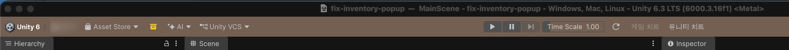
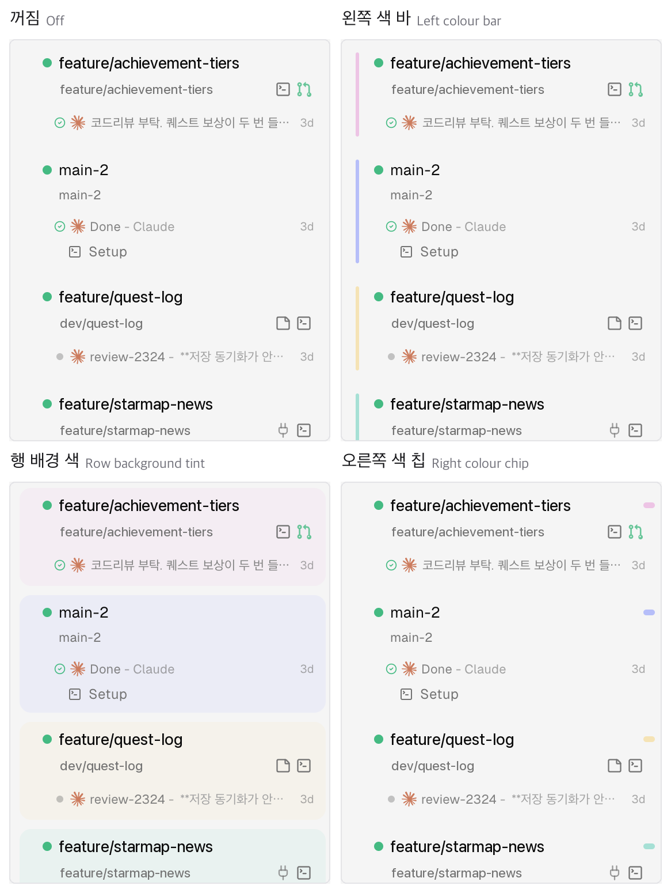
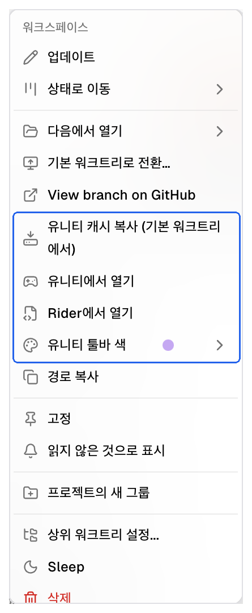
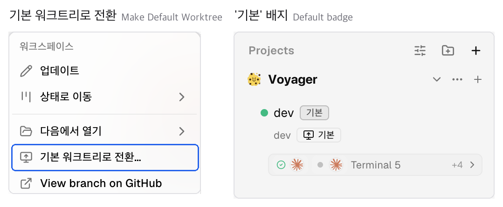

<h1 align="center">
  <a href="https://onOrca.dev"></a> Orca
</h1>

<p align="center">
  <a href="https://github.com/stablyai/orca"></a>
  <a href="https://github.com/stablyai/orca/releases"></a>
  
  <a href="https://discord.gg/fzjDKHxv8Q"></a>
  <a href="https://x.com/orca_build"></a>
  
</p>

<p align="center">
  <sub><a href="../../README.md">English</a> · <a href="README.zh-CN.md">中文</a> · <a href="README.ja.md">日本語</a> · <a href="README.es.md">Español</a> · <a href="README.fr.md">Français</a> · <a href="README.pt.md">Português</a></sub>
</p>

<p align="center">
  <strong>100x 빌더를 위한 AI 오케스트레이터.</strong><br/>
  Codex, Claude Code, OpenCode, Pi를 나란히 실행하세요. — 각 에이전트는 자체 worktree에서 실행되고 한곳에서 추적됩니다.
</p>

<h3 align="center"><a href="https://onorca.dev/download"><ins>Orca 다운로드</ins></a></h3>

<p align="center">
  
</p>

> [!NOTE]
> ### 이건 포크입니다 — [machamy/orca](https://github.com/machamy/orca)
>
> [stablyai/orca](https://github.com/stablyai/orca)의 개인 포크입니다.
> **원본 기능은 전부 그대로 살아 있고**, 바로 아래
> ["이 포크가 더한 것"](#이-포크가-더한-것)만 원본에 없는 내용입니다.
>
> - **변경 이력**: [`FORK_CHANGELOG.md`](../../FORK_CHANGELOG.md)(한국어 원본) ·
>   [`FORK_CHANGELOG.en.md`](../../FORK_CHANGELOG.en.md)(영어 번역). 단계별 상세와 커밋
>   해시는 이 README가 아니라 변경 이력에만 둡니다.
> - **버전 표기**: `<원본 버전>.machamy.<N>.local.<타임스탬프>.<커밋12자리>` — 예:
>   `1.4.178-rc.2.machamy.7.local.…`. `N`은 루트 [`FORK_VERSION`](../../FORK_VERSION)
>   값이고 포크 기능 마일스톤마다 오릅니다.
> - **배포 불가 — 각자 직접 빌드하세요.** 로컬 빌드는 자체 서명(`Orca Local Signing`)이라
>   Apple Developer ID도 공증도 없습니다. 빌드본을 남에게 전달하면 받는 쪽 Gatekeeper가
>   거부합니다(`spctl` rejected). → [설치](#설치)
> - 이 포크의 문서는 **한국어가 원본**이고 영어판은 번역입니다.

## 이 포크가 더한 것

유니티 프로젝트를 워크트리 여러 개로 동시에 굴릴 때 생기는 두 가지 혼란을 다룹니다 —
**"지금 보고 있는 에디터가 어느 워크트리인가"** 와
**"어느 브랜치가 리포 폴더에 놓여 있는가"**.

<table>
<tr>
<td width="50%" valign="middle">

### 워크트리마다 다른 유니티 색

에디터를 두 개 열어두고 어느 쪽이 어느 워크트리인지 헷갈린 적이 있다면. 생성된 에디터
스크립트가 **플레이 버튼이 있는 툴바**를 워크트리별 색으로 칠하고 **창 제목 앞에 워크트리
이름**을 붙입니다. 색은 20색(1차 10 + 2차 10)에서 형제 워크트리와 겹치지 않게 배정되고,
워크트리 우클릭 → **유니티 툴바 색**에서 프리셋 10색이나 컬러 피커로 직접 고를 수도
있습니다(다른 워크트리가 이미 고른 색은 잠깁니다). **기본 워크트리는 무색**이라 "색이
있으면 사이드 워크트리"로 읽힙니다.

스크립트는 gitignore된 경로에만 쓰고, **쓰기 전에 git에게 무시되는 경로인지 물어본 뒤
아니면 그 리포는 통째로 건너뜁니다** — 추적될 파일은 절대 만들지 않습니다.

</td>
<td width="50%">
  
</td>
</tr>
<tr>
<td width="50%" valign="middle">

### 사이드바에도 같은 색

Orca 사이드바 행에 그 워크트리의 유니티 색을 그대로 비춥니다. 프로젝트별로 **끄기 / 왼쪽
색 막대 / 행 배경 틴트 / 오른쪽 색 칩** 중에 고르고, 리포 ⋯ 메뉴에서 항목에 마우스를
올리면 실제 행에 미리보기가 걸립니다. 기본은 색 막대이며, 유니티 프로젝트로 확인된
리포에서만 켜집니다.

</td>
<td width="50%">
  
</td>
</tr>
<tr>
<td width="50%" valign="middle">

### 유니티 워크트리 액션

워크트리 우클릭 한 번에 **유니티용 Library 복사**(기본 체크아웃에서 APFS 복사 — 수 초,
추가 용량 거의 0) · **Unity에서 열기**(`ProjectVersion.txt`에 적힌 바로 그 에디터
버전으로) · **Rider에서 열기**(유니티가 만든 `.sln`으로. 워크트리에 없으면 기본
체크아웃에서 복사해 옵니다).

Library 복사는 **켜져 있는 에디터의 Library를 절대 복사하지 않습니다** — lockfile,
프로세스 테이블, 최근 실행 TTL 3중 게이트로 거르고, 복사가 끝난 뒤에 한 번 더 확인합니다.
스테이징 폴더에 받아 원자적 rename으로 완성하므로 중간에 죽어도 반쪽 Library가 남지
않습니다.

</td>
<td width="50%">
  
</td>
</tr>
<tr>
<td width="50%" valign="middle">

### 기본 워크트리 전환

서브 워크트리를 리포의 기본 체크아웃으로 승격합니다. 폴더를 옮기는 게 아니라 **두
워크트리의 브랜치를 제자리에서 맞바꿉니다** — git의 main worktree(`.git` 보유자)와 리포
폴더 경로가 그대로라, 리포 폴더를 보고 있는 GitHub Desktop이나 IDE가 승격된 브랜치를 바로
봅니다. 커밋 안 된·스테이징된·untracked 변경은 브랜치를 따라가고(전환 팝업에서 untracked는
제자리에 두기를 고를 수 있습니다), ignored 파일은 제자리에 남습니다.

워크트리를 **Default** 카드에 드롭하거나 `orca worktree default set --worktree <선택자>`.
선택 옵션인 **에이전트가 브랜치를 따라가기**를 켜면 양쪽 워크트리를 절전한 뒤 각 에이전트를
자기 브랜치가 이제 있는 워크트리에서 재개합니다(Claude·Codex).

</td>
<td width="50%">
  
</td>
</tr>
</table>

**그 밖에 이 포크가 더한 것:**

- **`pnpm test:fork`** — 포크 기능에 걸린 테스트만 한 번에 돌리는 회귀 관문. 원본을 병합한
  뒤 포크가 아직 살아 있는지 빠르게 확인합니다. 목록은
  [`config/fork-contract-tests.mjs`](../../config/fork-contract-tests.mjs)에 있고, 병합이
  목록의 파일을 지우면 메타 테스트가 즉시 실패합니다.
- **마크다운 GitHub 스타일 보기** — 원시 HTML이 섞여 프리뷰가 막는 .md도 안내 배너의
  버튼으로 GitHub-flavored 렌더링으로 볼 수 있습니다.
- **첫 실행 유니티 크래시 회피** — Firebase 플러그인이 매 에디터 로드마다
  `google-services-desktop.json`을 재생성하는데, 그게 시드 직후 첫 임포트 폭풍과 겹치면
  유니티가 죽었습니다("두 번 열어야 되는" 증상). 생성 파일이 소스와 바이트 동일할 때만
  mtime을 맞춰 재생성 자체를 건너뛰게 합니다.
- **사이드바 기본 행 판정** — 별 배지·정렬 앵커·숨김 필터·삭제 가드를 git의
  `isMainWorktree`가 아니라 **리포 경로** 기준으로 판정해, 전환 후에도 올바른 행이
  "기본"으로 보입니다.
- **브랜치 스왑 데이터 안전성 하드닝** — 부분 캡처 복원, post-checkout 훅 내성,
  merge/cherry-pick/revert 진행 중 워크트리 사전 거부.

> [!IMPORTANT]
> **검증 범위와 알려진 한계** — 감추지 않고 적어 둡니다.
>
> - 브랜치 스왑, "에이전트 유지" 모드, 데이터 안전성 케이스는 실제 git 저장소와 회귀
>   테스트로 검증했습니다. **"에이전트 따라가기"** 는 12팬 실기 구성에서 계약 14항목을
>   36라운드 연속 통과했지만 **macOS arm64 한 구성에서만** 확인했고, Linux·Windows·SSH는
>   미검증입니다.
> - 유니티 쪽은 실제 에디터(6000.3.16f1)로 확인했습니다. **Library 복사와 "Rider에서
>   열기"는 macOS 전용**입니다(복사는 APFS Copy-on-Write에 의존). "Unity에서 열기"와 툴바
>   색은 다른 OS에서도 동작하도록 짜여 있지만 **검증은 macOS에서만** 했습니다.
> - **"에이전트에게 알리기" 토글은 팬에 문구를 실제로 써 넣지만, 전송까지 보장하지는
>   않습니다.** 전환 후 6·15·30·60·90초에 걸쳐, 깨어난 에이전트 팬마다 한 번씩 바뀐
>   경로와 브랜치를 입력창에 씁니다(턴이 진행 중인 팬은 건드리지 않습니다). 문구 끝에
>   Enter를 붙이지만 에이전트 TUI가 그걸 받지 않고 문구만 남기는 경우가 있어, 그때는
>   직접 Enter를 눌러야 전송됩니다.
> - 전환 시 플레인 셸의 스크롤백은 유실됩니다(프로세스를 옮길 수 없습니다). 탭·위치·분할은
>   유지됩니다.
> - 툴바 색은 유니티 6000.3 이상에서 메인 툴바를 칠하고, 그 이전 에디터에서는 씬 뷰 상단
>   막대로 대체됩니다. 어느 쪽도 실패하면 조용히 기본 색으로 남습니다.

---

## 기능

아래부터는 **원본 Orca**의 기능입니다 — 이 포크에서도 전부 그대로 동작합니다.

<table>
<tr>
<td width="50%" valign="middle">

### 모바일 Companion

휴대폰에서 에이전트를 모니터링하고 조종하세요 — 에이전트가 완료되면 알림을 받고 어디서든 후속 지시를 보낼 수 있습니다.

[iOS App Store](https://apps.apple.com/us/app/orca-ide/id6766130217) · [TestFlight](https://testflight.apple.com/join/YjeGMQBA) · [Android APK 0.0.43](https://github.com/stablyai/orca/releases/download/mobile-android-v0.0.43/app-release.apk) · [문서 →](https://www.onorca.dev/docs/mobile)

</td>
<td width="50%">
  <a href="https://www.onorca.dev/docs/mobile"><picture><source srcset="../assets/feature-wall/mobile-companion-app-showcase.gif" type="image/gif"></picture></a>
</td>
</tr>
<tr>
<td width="50%" valign="middle">

### 병렬 Worktree

하나의 프롬프트를 다섯 에이전트에 동시에 보내세요. 각 에이전트는 격리된 자체 git worktree에서 실행됩니다 — 결과를 비교하고 가장 좋은 것을 머지하세요.

[문서 →](https://www.onorca.dev/docs/model/worktrees)

</td>
<td width="50%">
  <a href="https://www.onorca.dev/docs/model/worktrees"><picture><source srcset="../assets/feature-wall/parallel-worktrees.gif" type="image/gif"></picture></a>
</td>
</tr>
<tr>
<td width="50%" valign="middle">

### 터미널 분할

WebGL 렌더링, 무한 분할, 재시작 후에도 유지되는 스크롤백을 갖춘 Ghostty급 터미널.

[문서 →](https://www.onorca.dev/docs/terminal)

</td>
<td width="50%">
  <a href="https://www.onorca.dev/docs/terminal"><picture><source srcset="../assets/feature-wall/terminal-splits.gif" type="image/gif"></picture></a>
</td>
</tr>
<tr>
<td width="50%" valign="middle">

### 디자인 모드

실제 Chromium 창에서 UI 요소를 클릭하면 해당 HTML, CSS, 잘라낸 스크린샷이 에이전트 프롬프트로 바로 전송됩니다.

[문서 →](https://www.onorca.dev/docs/browser/design-mode)

</td>
<td width="50%">
  <a href="https://www.onorca.dev/docs/browser/design-mode"><picture><source srcset="../assets/feature-wall/design-mode.gif" type="image/gif"></picture></a>
</td>
</tr>
<tr>
<td width="50%" valign="middle">

### GitHub &amp; Linear 네이티브

PR, issue, 프로젝트 보드를 앱 안에서 탐색하세요 — 어떤 작업에서든 worktree를 열고 컨텍스트 전환 없이 리뷰할 수 있습니다.

[문서 →](https://www.onorca.dev/docs/review/linear)

</td>
<td width="50%">
  <a href="https://www.onorca.dev/docs/review/linear"><picture><source srcset="../assets/feature-wall/github-linear.gif" type="image/gif"></picture></a>
</td>
</tr>
<tr>
<td width="50%" valign="middle">

### SSH Worktree

강력한 원격 머신에서 에이전트를 실행하세요. 파일 편집, git, 터미널을 모두 지원하며 자동 재연결과 포트 포워딩도 포함됩니다.

[문서 →](https://www.onorca.dev/docs/ssh)

</td>
<td width="50%">
  <a href="https://www.onorca.dev/docs/ssh"><picture><source srcset="../assets/feature-wall/ssh-worktrees.gif" type="image/gif"></picture></a>
</td>
</tr>
<tr>
<td width="50%" valign="middle">

### AI Diff 주석

diff의 어느 줄에든 코멘트를 남기고 에이전트에게 바로 보내세요 — Orca를 떠나지 않고 리뷰하고 수정하고 커밋할 수 있습니다.

[문서 →](https://www.onorca.dev/docs/review/annotate-ai-diff)

</td>
<td width="50%">
  <a href="https://www.onorca.dev/docs/review/annotate-ai-diff"><picture><source srcset="../assets/feature-wall/annotate-diff.gif" type="image/gif"></picture></a>
</td>
</tr>
<tr>
<td width="50%" valign="middle">

### 에이전트로 파일 드래그

어디서나 자동 저장되는 VS Code 에디터 — 파일이나 이미지를 에이전트 프롬프트로 바로 드래그하세요.

[문서 →](https://www.onorca.dev/docs/editing/file-explorer)

</td>
<td width="50%">
  <a href="https://www.onorca.dev/docs/editing/file-explorer"><picture><source srcset="../assets/feature-wall/file-drag.gif" type="image/gif"></picture></a>
</td>
</tr>
<tr>
<td width="50%" valign="middle">

### Orca CLI

에이전트도 Orca를 조작할 수 있습니다 — `orca worktree create`, `snapshot`, `click`, `fill`로 모든 워크플로를 스크립팅하세요.

[문서 →](https://www.onorca.dev/docs/cli/overview)

</td>
<td width="50%">
  <a href="https://www.onorca.dev/docs/cli/overview"><picture><source srcset="../assets/feature-wall/orca-cli.gif" type="image/gif"></picture></a>
</td>
</tr>
</table>

**그 밖에 기본으로 제공되는 기능:**

- **[빠른 열기](https://www.onorca.dev/docs/model/quick-open)** — 작업 흐름을 벗어나지 않고 worktree, 파일, 에이전트, 커맨드, 리포지토리 컨텍스트를 검색하세요.
- **[계정 전환 및 사용량 추적](https://www.onorca.dev/docs/agents/usage-tracking)** — Claude와 Codex의 사용량과 rate limit 초기화 시점을 확인하고, 다시 로그인하지 않고 계정을 바로 전환하세요.
- **[풍부한 리포지토리 미리보기](https://www.onorca.dev/docs/editing/markdown)** — Markdown, 이미지, PDF, 리포지토리 문서를 워크스페이스에서 미리 볼 수 있습니다.
- **[Computer Use](https://www.onorca.dev/docs/cli/computer-use)** — 워크플로에 실제 상호작용이 필요할 때 에이전트가 데스크톱 앱과 화면에 보이는 UI를 직접 조작하게 하세요.
- **[알림과 읽지 않음 상태](https://www.onorca.dev/docs/notifications)** — 에이전트가 완료되거나 주의가 필요할 때 알림을 받고, 스레드를 읽지 않음으로 표시해 나중에 다시 확인하세요.
- **그리고 훨씬 더 많은 기능** — 새로운 기능이 매일 출시되므로 이 목록은 늘 한 발 늦습니다. 진짜 기능은 [체인지로그](https://github.com/stablyai/orca/releases)에서 확인하세요.

---

## 지원 에이전트

**모든 CLI 에이전트**와 함께 작동합니다 — 터미널에서 실행되는 에이전트라면 Orca에서도 실행됩니다.

<p>
  <a href="https://docs.anthropic.com/claude/docs/claude-code"><kbd> Claude Code</kbd></a> &nbsp;
  <a href="https://github.com/openai/codex"><kbd> Codex</kbd></a> &nbsp;
  <a href="https://x.ai/cli"><kbd> Grok</kbd></a> &nbsp;
  <a href="https://cursor.com/cli"><kbd> Cursor</kbd></a> &nbsp;
  <a href="https://docs.github.com/en/copilot/how-tos/set-up/install-copilot-cli"><kbd> GitHub Copilot</kbd></a> &nbsp;
  <a href="https://opencode.ai/docs/cli/"><kbd> OpenCode</kbd></a> &nbsp;
  <a href="https://mimo.xiaomi.com/coder"><kbd> MiMo Code</kbd></a> &nbsp;
  <a href="https://ampcode.com/manual#install"><kbd> Amp</kbd></a> &nbsp;
  <a href="https://openclaude.gitlawb.com/"><kbd> OpenClaude</kbd></a> &nbsp;
  <a href="https://antigravity.google/docs/cli-overview"><kbd> Antigravity</kbd></a> &nbsp;
  <a href="https://pi.dev"><kbd> Pi</kbd></a> &nbsp;
  <a href="https://omp.sh"><kbd> oh-my-pi</kbd></a> &nbsp;
  <a href="https://hermes-agent.nousresearch.com/docs/"><kbd> Hermes Agent</kbd></a> &nbsp;
  <a href="https://devin.ai/cli"><kbd> Devin</kbd></a> &nbsp;
  <a href="https://block.github.io/goose/docs/quickstart/"><kbd> Goose</kbd></a> &nbsp;
  <a href="https://docs.augmentcode.com/cli/overview"><kbd> Auggie</kbd></a> &nbsp;
  <a href="https://github.com/autohandai/code-cli"><kbd> Autohand Code</kbd></a> &nbsp;
  <a href="https://github.com/charmbracelet/crush"><kbd> Charm</kbd></a> &nbsp;
  <a href="https://docs.cline.bot/cline-cli/overview"><kbd> Cline</kbd></a> &nbsp;
  <a href="https://www.codebuff.com/docs/help/quick-start"><kbd> Codebuff</kbd></a> &nbsp;
  <a href="https://commandcode.ai/docs/quickstart"><kbd> Command Code</kbd></a> &nbsp;
  <a href="https://docs.continue.dev/guides/cli"><kbd> Continue</kbd></a> &nbsp;
  <a href="https://docs.factory.ai/cli/getting-started/quickstart"><kbd> Droid</kbd></a> &nbsp;
  <a href="https://kilo.ai/docs/cli"><kbd> Kilocode</kbd></a> &nbsp;
  <a href="https://www.kimi.com/code/docs/en/kimi-code-cli/getting-started.html"><kbd> Kimi</kbd></a> &nbsp;
  <a href="https://kiro.dev/docs/cli/"><kbd> Kiro</kbd></a> &nbsp;
  <a href="https://github.com/mistralai/mistral-vibe"><kbd> Mistral Vibe</kbd></a> &nbsp;
  <a href="https://github.com/QwenLM/qwen-code"><kbd> Qwen Code</kbd></a> &nbsp;
  <a href="https://support.atlassian.com/rovo/docs/install-and-run-rovo-dev-cli-on-your-device/"><kbd> Rovo Dev</kbd></a> &nbsp;
  <kbd>+ any CLI agent</kbd>
</p>

---

## 설치

### 이 포크를 쓰려면 — 소스에서 직접 빌드

아래 배포 채널은 **전부 원본(stablyai/orca)** 이라 이 포크의 변경이 하나도 없습니다.
[이 포크가 더한 것](#이-포크가-더한-것)을 쓰려면 직접 빌드하세요.

```bash
git clone https://github.com/machamy/orca.git
cd orca
pnpm install
pnpm build:mac        # Linux는 build:linux, Windows는 build:win
```

빌드된 앱은 `dist/mac-arm64/Orca.app`(Intel은 `dist/mac`)에 나옵니다. 자기 머신에서 빌드한
앱에는 격리 속성이 붙지 않으므로 Gatekeeper를 건드릴 일이 없습니다.

- **요구사항**: Node 24, pnpm 10.24.0.
- **`build:mac` 실행 중에는 저장소 파일을 건드리지 마세요.** x64와 arm64를 한 번의 파일
  스캔으로 패키징해서, 도중에 파일 크기가 바뀌면 `app.asar` 오프셋이 어긋나 arm64 앱이
  **로그 한 줄 없이** 종료됩니다. x64는 멀쩡해 보여서 오진하기 쉽습니다. 빌드 확인은
  패키징된 바이너리를 직접 실행해 보세요
  (`dist/mac-arm64/Orca.app/Contents/MacOS/Orca`): 출력 없이 exit 1이면 asar가 어긋난
  것이니, 저장소에 아무것도 쓰지 않은 상태로 다시 빌드하면 됩니다.

### 데스크톱 — macOS, Windows, Linux (원본 배포본, 포크 변경 없음)

- **[onOrca.dev에서 다운로드](https://onorca.dev/download)**
- 또는 빌드를 직접 받기: [macOS Apple Silicon](https://github.com/stablyai/orca/releases/latest/download/orca-macos-arm64.dmg) · [macOS Intel](https://github.com/stablyai/orca/releases/latest/download/orca-macos-x64.dmg) · [Windows (.exe)](https://github.com/stablyai/orca/releases/latest/download/orca-windows-setup.exe) · [Linux AppImage](https://github.com/stablyai/orca/releases/latest/download/orca-linux.AppImage) · [전체 빌드](https://github.com/stablyai/orca/releases/latest)
- headless Linux 서버에서 `orca serve`를 실행하시나요? [Headless Linux 서버 가이드](../reference/headless-linux-server.md)를 확인하세요.

_또는 패키지 매니저로 설치:_

```bash
# macOS (Homebrew)
brew install --cask stablyai/orca/orca

# Arch Linux (AUR) — or stably-orca-git to build from source
yay -S stably-orca-bin
```

### 모바일 Companion — iOS, Android

데스크톱 앱과 페어링해 휴대폰에서 에이전트를 모니터링하고 조종하세요.

- **iOS:** [App Store에서 다운로드](https://apps.apple.com/us/app/orca-ide/id6766130217) 또는 [TestFlight 참여](https://testflight.apple.com/join/YjeGMQBA)
- **Android:** [APK 0.0.43 다운로드](https://github.com/stablyai/orca/releases/download/mobile-android-v0.0.43/app-release.apk)

---

## 커뮤니티와 지원

- **Discord:** **[Discord](https://discord.gg/fzjDKHxv8Q)** 커뮤니티에 참여하세요.
- **Twitter / X:** 업데이트와 공지는 **[@orca_build](https://x.com/orca_build)** 를 팔로우하세요.
- **WeChat:** QR 코드를 스캔해 Orca 커뮤니티 WeChat 그룹 7에 참여하세요.

  

- **피드백과 아이디어:** 우리는 빠르게 출시합니다. 필요한 기능이 있나요? [새 기능을 요청](https://github.com/stablyai/orca/issues)하세요.
- **개인정보 보호:** Orca가 수집하는 익명 사용 데이터와 수집 거부 방법은 [개인정보 및 텔레메트리 문서](https://www.onorca.dev/docs/telemetry)를 참고하세요.
- **응원하기:** 이 리포지토리에 [Star](https://github.com/stablyai/orca)를 눌러 매일 공개되는 릴리스 소식을 확인해 주세요.

---

## 개발

기여하거나 로컬에서 실행하고 싶으신가요? [CONTRIBUTING.md](../../.github/CONTRIBUTING.md) 가이드를 확인하세요.

<a href="https://github.com/stablyai/orca/graphs/contributors">
  
</a>

<p align="center">
  
</p>

## 서명된 빌드

Windows 코드 서명은 [SignPath.io](https://signpath.io)가 후원·제공하며, 인증서는 [SignPath Foundation](https://signpath.org)에서 제공합니다.

## 라이선스

Orca는 [MIT 라이선스](../../LICENSE)에 따라 자유롭게 사용할 수 있는 오픈 소스입니다.
